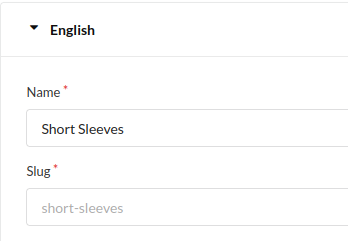
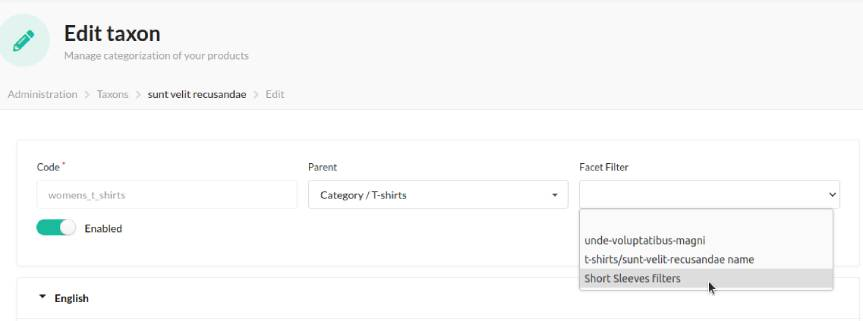

<p align="center">
</p>


<h1 align="center">Asdoria Facet Filter Bundle</h1>

<p align="center">
This plugin allows to to link facets to specific resources in your Sylius Shop

Sylius offers a system of products' attribute, options and some more. However, there's no native way to only use them on product from specific taxons(categories).
This may be a problem when/if you wish to let the user filter your catalog by using these facets.
Our plugin allows you to link specific attributes, options and other facets to specific taxons. This way, you can easily decide which filters to display and where

[//]: # (Sylius a une notion d'attributs de produits, d'options de produits et autres.)

[//]: # (Cependant, il n'y a pas de moyen intégré pour rendre ces attributs, options, taxons uniquement pertinents pour les produits dans des catégories spécifiques.)

[//]: # (Cela peut être un problème si/quand vous voulez permettre aux visiteurs de filtrer le catalogue de produits en utilisant ces facettes. )

[//]: # (Ce plugin permet de lier des attributs spécifiques, des options et d'autres facettes à des taxons u autre ressoures, ce qui vous permet de décider plus facilement quels filtres afficher à quel endroit.)
</p>

## Features

+ Create groups of facets
+ Create customizable facet filters tied to specific products' characteristics
+ Easily create facet collections
+ Attach the facet filters to your taxons or other resources

<div style="max-width: 75%; height: auto; margin: auto">


</div>

## Installation

---
2. run `composer require asdoria/sylius-facet-filter-plugin`


3. Add the bundle in `config/bundles.php`. You must put it ABOVE `SyliusGridBundle`

```php
Asdoria\SyliusFacetFilterPlugin\AsdoriaSyliusFacetFilterPlugin::class => ['all' => true],
[...]
Sylius\Bundle\GridBundle\SyliusGridBundle::class => ['all' => true],
```

4. Import routes in `config/routes.yaml`

```yaml
asdoria_facet_filter:
    resource: "@AsdoriaSyliusFacetFilterPlugin/Resources/config/routing.yaml"
    prefix: /admin
```


5. add the facets_filters filter into you grid config exemple for in `config/packages/grids/sylius_shop_product.yaml` but is already configure into the bundle for this grid
```yaml
sylius_grid:
    grids:
        sylius_shop_product:
            filters:
                facets_filters:
                    type: facets_filters
                    label: false
                    options:
                        owner: taxon
 #                      filterBy: owner | funnel
 # this option "filterBy" is optional but if you specify funnel, the different filters will be filled with the rest of the filtered products.
 # this option "filterBy" is optional but if you specify owner, the different filters will be filled with the list of attributes of the category.
 # This option "filterBy" is optional but if you don't specify it, the different filters will be filled with the list of attributes of all shops.
```

6. Import the plugin's config in `config/packages/_sylius.yaml`
```yaml
imports:
    - { resource: "@AsdoriaSyliusFacetFilterPlugin/Resources/config/config.yaml"}
```

6. Implement the Facet Interface and Trait in your Taxon Entity `App/Entity/Taxonomy/Taxon.php`.

```php
// ...

use Asdoria\SyliusFacetFilterPlugin\Model\Aware\FacetFilterCodeAwareInterface;
use Asdoria\SyliusFacetFilterPlugin\Traits\FacetFilterCodeTrait;
use Doctrine\ORM\Mapping as ORM;
use Sylius\Component\Core\Model\Taxon as BaseTaxon;
use Sylius\Component\Taxonomy\Model\TaxonTranslationInterface;

/**
 * @ORM\Entity
 * @ORM\Table(name="sylius_taxon")
 */
class Taxon extends BaseTaxon implements FacetFilterCodeAwareInterface
{
    use FacetFilterCodeTrait;

    protected function createTranslation(): TaxonTranslationInterface
    {
        return new TaxonTranslation();
    }
}
```
6. Override the Taxon Form template in `templates/bundles/SyliusAdminBundle/Taxon/_form.html.twig`.

```twig



<div class="ui segment">
    {{ form_errors(form) }}
    <div class="three fields">
        {{ form_row(form.code) }}
        {{ form_row(form.parent) }}
        {{ form_row(form.facetFilterCode) }}
    </div>
    <div class="fields">
        {{ form_row(form.enabled) }}
    </div>
</div>
{{ translationFormWithSlug(form.translations, '@SyliusAdmin/Taxon/_slugField.html.twig', taxon) }}



```
7. run `php bin/console do:mi:mi` to update the database schema

## Usage

1. In the back office, inside the `Configuration` section, enter `Configure Facet Filters`
2. Click `Edit Groups` and create a new one. Groups will help you organize your filters and group them when displaying on your site.
3. Click `Create` and configure your group as you wish
4. Return to the Facet Filter configuration page, and click `Create` to initialize Filters targetting a specific Taxon
Inside the Code input, enter the code of a taxon you wish to create a filter for. This code can be found in the taxon's edit page at `{your-domain}/admin/taxons/{id}/edit` under Slug
<div style="display:flex; align-items: center; justify-content: center;">



</div>

5. Going Back to the `Configure Facet Filters` page, we can now see our filter. Click `Edit facets` then `Facets list`, you can then create a new targeting the characteristic you need
null5. Here you can create filters based on a product's category, attributes or options. Let's say you wish to filter products by their attributes : Click Create then Create an attribute facet
6. Pick the relevant attribute under `Select an attribute to filter`. You can then select the type of field your customer will use to filter. Right under this, update the segment value to match the Facet Group created in step 2
7. Go back to the edit page of your taxon `{your-domain}/admin/taxons/{id}/edit`. Your are now able to apply your new facet filter
 
<div style="max-width:75%; height: auto; margin: auto;">

 

</div>


8. Now when going to the taxon's page on your website (e.g. `{domain}/taxons/short-sleeves`), your filters will be displayed and grouped according to the segments selected in step 6

<div style="max-width: 75%; height: auto; margin: auto">

   

</div>


